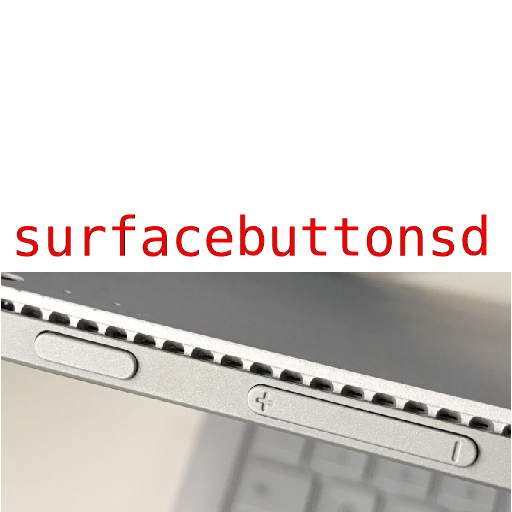

Get surface's physical buttons working again!
# What is it?
surfacebuttonsd is a systemd unit that can re-enable the physical buttons of your surface on Linux.
It works by reloading the kernel module `soc_button_array` at startup. Pretty easy!
# How to install
You can install it on debian-based distros with the debian package in the "Releases" tab or, in other distros by copying the `surfacebuttonsd.service` in `/etc/systemd/system` and then running these commands as root:
`systemctl daemon-reload`
`systemctl enable --now surfacebuttonsd.service`
and reboot.
# License
This project is licensed under the GPL (GNU General Public License).
The source code is distributed under the terms of the GPL license.
You are free to use, modify, and redistribute this software under the terms of the GPL
